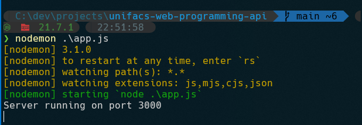

> Repositório do projeto do curso de ciência da computação da UNIFACS, matéria `Desenvolvimento de Software para Web`

Dependências:

```
node.js na versão 21.7.1 ou versão compatível
```

```
Para Windows:
scoop install node (vem com npm)

Archlinux:
yay -S nodejs npm
```

Passo a passo

Executar o comando em qualquer path do sistema no terminal (instala o programa nodemon no path global do sistema, sendo possivel o executar de qualquer pasta)
```sh
npm i -g nodemon
```

No path onde se encontra o repositório, executar
```sh
npm i # instala as dependências, de forma recursiva, especificadas em `package.json` na pasta node_modules
nodemon .\app.js
```

O comando `nodemon` é a versão aprimorada do ordinário `node .\app.js`, com listener de mudança de arquivos e suas dependências, sempre que houver uma mudança, o servidor re-executa o comando automaticamente.

Depois disso, será possível ver uma tela como esta



